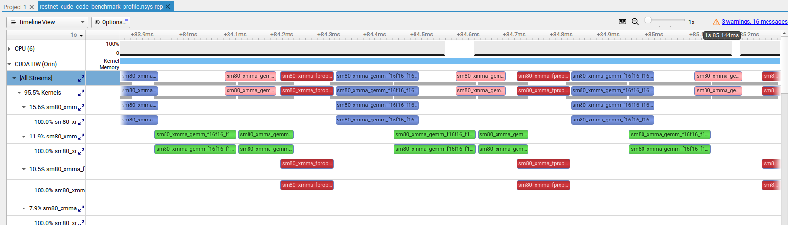

# Inference Optimization & Memory Management
Target Hardware: NVIDIA Orin Nano (8GB) | JetPack 6.x | CUDA 12.6

1. TensorRT : Is designed for execution. Layer Fusion: TensorRT combines multiple layers (like Convolution, Bias, and ReLU) into a single "kernel" to reduce the number of times data is moved in/out of the GPU memory.
Precision Calibration: It can convert 32-bit (FP32) models to 16-bit (FP16) or 8-bit (INT8) using the Orin's specialized Tensor Cores, often doubling performance with negligible accuracy loss.
Kernel Auto-Tuning: During the "build" phase, TensorRT tests hundreds of different ways to run your specific model on the Orin Nano's 1024 cores and picks the mathematically fastest version for your specific hardware.
This code example is of FP16-bit and reset50 base model

3. Understanding the Memory "Handshake": In a standard PC, the CPU and GPU have separate RAM. On the Jetson Orin Nano, they share the same physical memory (Unified Memory), but they "see" it differently. To run inference, data must travel a specific path.
The Lifecycle of an Inference Frame:
- Host Allocation (CPU): Create a buffer in System RAM.
- Device Allocation (GPU): Reserve a specific address space in the GPU’s VRAM.
- H2D (Host to Device): Copy your image data from the CPU's space to the GPU's space.
- Inference: The GPU processes the data at that address.
- D2H (Device to Host): Copy the results (probabilities/boxes) back to the CPU's space so Python can read them.
- Optimization: Pinned (Pagelocked) Memory
Standard Python memory is "pageable," meaning the OS can move it around. This forces the CPU to do an extra internal copy before the GPU can see it.
We use cuda.pagelocked_empty to "pin" the memory. This tells the OS: "Don't move this; the GPU is going to talk to this address directly." ( only for Jetson nano orin )

5. Essential Memory Code Patterns : 
PyCUDA to handle these transfers reliably on Jetson.
Step A: The Setup (Once per App)
```python
# Create Pinned Host memory (CPU)
h_input = cuda.pagelocked_empty(tuple(input_shape), dtype=np.float32)
h_output = cuda.pagelocked_empty(tuple(output_shape), dtype=np.float32)

# Reserve Device memory (GPU)
d_input = cuda.mem_alloc(h_input.nbytes)
d_output = cuda.mem_alloc(h_output.nbytes)
```

Step B: The Transfer (Every Frame)
```python
# 1. Copy Image to GPU (Host to Device)
cuda.memcpy_htod_async(d_input, h_input, stream)

# 2. Run the Model
context.execute_async_v3(stream_handle=stream.handle)

# 3. Copy Results to CPU (Device to Host)
# Without this, 'h_output' will stay empty/zeros!
cuda.memcpy_dtoh_async(h_output, d_output, stream)

# 4. Wait for the GPU to finish
stream.synchronize()
```

Benchmarks (ResNet-style Model in MAXN Mode)
Configuration	Latency	Performance
1 Stream	2.39 ms	Ultra-Low Latency
10 Streams	27.59 ms	High-Density (30 FPS x 10)
5. Summary for New Developers

Allocate Once: (Importent) Never call mem_alloc or pagelocked_empty in your main loop. It is slow and causes memory leaks.
Sync is Key: Always stream.synchronize() before you try to read the values in h_output, otherwise the CPU might read the data before the GPU is finished writing it.
MAXN Mode: Always run sudo jetson_clocks before benchmarking to ensure the hardware isn't "sleeping" between frames.

6. Create profile
Profile is created for ../cuda_prg/benchmark_reset.cu (C++)
```
nsys profile --trace=cuda,nvtx -o ../profile/restnet_cude_code_benchmark_profile ./benchmark
```

Output 
```
collecting data...
file Path is : ../enginefiles/resnet50_fp16_engine_pytorch.plan
Using an engine plan file across different models of devices is not recommended and is likely to affect performance or even cause errors.
Streams    | Latency (ms)    | Status
----------------------------------------
1          | 116.777         | OVER LIMIT
2          | 13.275          | OK
3          | 20.748          | OK
4          | 37.240          | OVER LIMIT
5          | 34.355          | OVER LIMIT
6          | 45.083          | OVER LIMIT
7          | 24.914          | OK
8          | 39.737          | OVER LIMIT
9          | 32.097          | OK
10         | 54.512          | OVER LIMIT
Generating '/tmp/nsys-report-4cbb.qdstrm'
[1/1] [0%                          ] restnet_cude_code_benchmark_profile.n[1/1] [0%                          ] restnet_cude_code_benchmark_profile.n[1/1] [5%                          ] restnet_cude_code_benchmark_profile.n[1/1] [7%                          ] restnet_cude_code_benchmark_profile.n[1/1] [=======39%                  ] restnet_cude_code_benchmark_profile.n[1/1] [===================79%      ] restnet_cude_code_benchmark_profile.n[1/1] [====================85%     ] restnet_cude_code_benchmark_profile.n[1/1] [=====================86%    ] restnet_cude_code_benchmark_profile.n[1/1] [=====================89%    ] restnet_cude_code_benchmark_profile.n[1/1] [========================100%] restnet_cude_code_benchmark_profile.n[1/1] [========================100%] restnet_cude_code_benchmark_profile.nsys-rep
Generated:
    /home/user/source/optinfrence/cuda_prg/../profile/restnet_cude_code_benchmark_profile.nsys-rep

```

7. Nsight 



### Key Observations from your Timeline
- Blue and Red Bars (Kernels): These represent your actual [TensorRT compute work](1.4.3, 1.4.8). Because multiple rows under CUDA HW show activity at the same vertical timestamp, your GPU is executing multiple kernels simultaneously.
- Green Bars (Memory Copies): These represent Host-to-Device (HtoD) transfers. Your profile shows Compute/Copy Overlap, where a Green bar on one stream occurs while a Blue/Red bar is active on another. This is why your latency improved; the GPU doesn't sit idle waiting for data.
- Visible Gaps: The gaps between kernels are primarily caused by Host Latency. This is the "CPU-to-GPU" overhead—the time it takes for the CPU to enqueue the next command through the driver before the GPU can start it. 

- Performance Insights
Occupancy: If a single kernel only uses a small percentage of the GPU's Streaming Multiprocessors (SMs), your multi-stream approach fills that "empty space" with work from other streams.
Serial vs. Overlapped: In a purely serial execution (1 stream), you would see one bar finish completely before the next one starts on the same row. Your image clearly shows parallelism across different stream indices.
